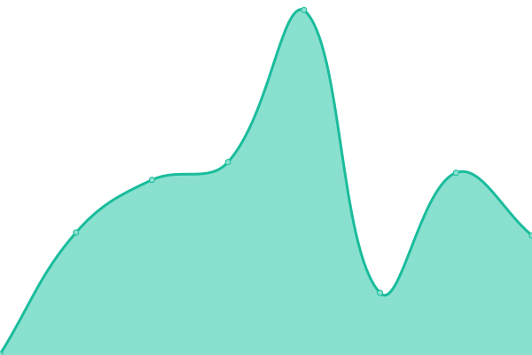

# [📈 Live Status](https://status.emailcheatcode.com): <!--live status--> **🟩 All systems operational**

This repository contains the open-source uptime monitor and status page for [Email Cheat Code](https://emailcheatcode.com), powered by [Upptime](https://github.com/upptime/upptime).

Email Cheat Code is an email monitoring and SMS alert service for Gmail and Microsoft 365, built for students, families, and anyone who needs to catch time-critical emails. This repository provides transparent, automated uptime monitoring for emailcheatcode.com. For security and compliance information, including our CASA Tier 2 certification (ID: 7155f26d, issued by TAC Security / App Defense Alliance), see our [Security and Trust site](https://watchmyinbox.com).

With [Upptime](https://upptime.js.org), you can get your own unlimited and free uptime monitor and status page, powered entirely by a GitHub repository. We use [Issues](https://github.com/jimc66/upptime-email-cheat-code/issues) as incident reports, [Actions](https://github.com/jimc66/upptime-email-cheat-code/actions) as uptime monitors, and [Pages](https://status.emailcheatcode.com) for the status page.

<!--start: status pages-->
<!-- This summary is generated by Upptime (https://github.com/upptime/upptime) -->
<!-- Do not edit this manually, your changes will be overwritten -->
<!-- prettier-ignore -->
| URL | Status | History | Response Time | Uptime |
| --- | ------ | ------- | ------------- | ------ |
|  [Email Cheat Code](https://emailcheatcode.com) | 🟩 Up | [email-cheat-code.yml](https://github.com/jimc66/upptime-email-cheat-code/commits/HEAD/history/email-cheat-code.yml) | 

 200ms
     
 | 

<a href="https://status.emailcheatcode.com/history/email-cheat-code">100.00%</a>
    

<!--end: status pages-->

[**Visit our status website →**](https://status.emailcheatcode.com)

## 📄 License

- Powered by: [Upptime](https://github.com/upptime/upptime)
- Code: [MIT](./LICENSE) © [Anand Chowdhary](https://anandchowdhary.com), supported by [Pabio](https://pabio.com)
- Data in the `./history` directory: [Open Database License](https://opendatacommons.org/licenses/odbl/1-0/)
